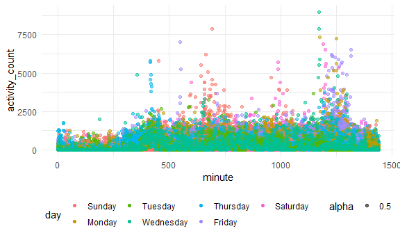

Homework 3
================
Ashwini Varghese
2022-10-15

## Setup for coding

## Problem 1

## Problem 2

Let’s load, tidy, and wrangling this dataset:

``` r
accel = read_csv("./accel_data.csv") %>% 
    janitor::clean_names() %>% 
    pivot_longer(
      activity_1:activity_1440,
      names_to = "minute",
      names_prefix = "activity_",
      values_to = "activity_count"
    ) %>% 
    mutate(day_type = if_else(day == "Saturday", "weekend",
                              if_else(day == "Sunday", "weekend", "weekday"))) %>%
    mutate(day = as.factor(day)) %>% 
    mutate(minute = as.numeric(minute)) %>% 
    mutate(day_type = as.factor(day_type)) %>% 
    mutate(day = fct_relevel(day, "Sunday", "Monday", "Tuesday", "Wednesday", "Thursday", "Friday", "Saturday"))
```

    ## Rows: 35 Columns: 1443
    ## ── Column specification ────────────────────────────────────────────────────────
    ## Delimiter: ","
    ## chr    (1): day
    ## dbl (1442): week, day_id, activity.1, activity.2, activity.3, activity.4, ac...
    ## 
    ## ℹ Use `spec()` to retrieve the full column specification for this data.
    ## ℹ Specify the column types or set `show_col_types = FALSE` to quiet this message.

``` r
accel
```

    ## # A tibble: 50,400 × 6
    ##     week day_id day    minute activity_count day_type
    ##    <dbl>  <dbl> <fct>   <dbl>          <dbl> <fct>   
    ##  1     1      1 Friday      1           88.4 weekday 
    ##  2     1      1 Friday      2           82.2 weekday 
    ##  3     1      1 Friday      3           64.4 weekday 
    ##  4     1      1 Friday      4           70.0 weekday 
    ##  5     1      1 Friday      5           75.0 weekday 
    ##  6     1      1 Friday      6           66.3 weekday 
    ##  7     1      1 Friday      7           53.8 weekday 
    ##  8     1      1 Friday      8           47.8 weekday 
    ##  9     1      1 Friday      9           55.5 weekday 
    ## 10     1      1 Friday     10           43.0 weekday 
    ## # … with 50,390 more rows

Description of dataset:

This dataset has 6 variable (`ncol(accel)`); week, day, and day_id were
from the original file untouched besides cleaning up the names using
`janitor::clean_names()` but the other 3 (minute, activity_count, and
day_type) are new variables created using `pivot_longer` and `mutate`.
This dataset has 50,400 observations, found using `nrow(accel)`.

Let’s now make a new variable that is the total activity count for a
given day and show it in a table:

``` r
accel2 <- accel %>% 
  group_by(week, day) %>% 
  summarize(total_activity = sum(activity_count)) %>% 
  pivot_wider(
    names_from = day,
    values_from = total_activity) %>% 
  knitr::kable(digits = 1)
```

    ## `summarise()` has grouped output by 'week'. You can override using the
    ## `.groups` argument.

``` r
accel2
```

| week | Sunday |   Monday |  Tuesday | Wednesday | Thursday |   Friday | Saturday |
|-----:|-------:|---------:|---------:|----------:|---------:|---------:|---------:|
|    1 | 631105 |  78828.1 | 307094.2 |    340115 | 355923.6 | 480542.6 |   376254 |
|    2 | 422018 | 295431.0 | 423245.0 |    440962 | 474048.0 | 568839.0 |   607175 |
|    3 | 467052 | 685910.0 | 381507.0 |    468869 | 371230.0 | 467420.0 |   382928 |
|    4 | 260617 | 409450.0 | 319568.0 |    434460 | 340291.0 | 154049.0 |     1440 |
|    5 | 138421 | 389080.0 | 367824.0 |    445366 | 549658.0 | 620860.0 |     1440 |

From this table, it is hard to determine if any trends are apparent over
the days and by each week.

So let’s then make a single panel that shows the 24-hour activity time
courses for each day:

``` r
accel %>%
  ggplot(aes(x = minute, y = activity_count, color = day)) +
  geom_point(aes(alpha = .5)) 
```



From this graph, we can see that the activity counts throughout any
given day are usually not higher than about 1,875. The exceptions are at
about the 400th minute, 560th minute, 650th minute, 1000th minute and
1,250th minute. The days of the week that we see these higher activity
counts are on Thursdays, Fridays, Sundays, and Saturdays, respectively.
At the 1,250th minute, on various days throughout the week, there is a
large activity count.

## Problem 3

Let’s load the data:

``` r
library(p8105.datasets)
data("ny_noaa")

ny_noaa
```

    ## # A tibble: 2,595,176 × 7
    ##    id          date        prcp  snow  snwd tmax  tmin 
    ##    <chr>       <date>     <int> <int> <int> <chr> <chr>
    ##  1 US1NYAB0001 2007-11-01    NA    NA    NA <NA>  <NA> 
    ##  2 US1NYAB0001 2007-11-02    NA    NA    NA <NA>  <NA> 
    ##  3 US1NYAB0001 2007-11-03    NA    NA    NA <NA>  <NA> 
    ##  4 US1NYAB0001 2007-11-04    NA    NA    NA <NA>  <NA> 
    ##  5 US1NYAB0001 2007-11-05    NA    NA    NA <NA>  <NA> 
    ##  6 US1NYAB0001 2007-11-06    NA    NA    NA <NA>  <NA> 
    ##  7 US1NYAB0001 2007-11-07    NA    NA    NA <NA>  <NA> 
    ##  8 US1NYAB0001 2007-11-08    NA    NA    NA <NA>  <NA> 
    ##  9 US1NYAB0001 2007-11-09    NA    NA    NA <NA>  <NA> 
    ## 10 US1NYAB0001 2007-11-10    NA    NA    NA <NA>  <NA> 
    ## # … with 2,595,166 more rows

The dataset has 7 variables (`ncol(ny_noaa)`) and 2595176 observations
(`nrow(ny_noaa)`). It has a combination of integer and character
variables, with also a date variable. The variables that make up the
dataset are an ID variable of the weather station, date of observation,
precipitation (mm), snowfall (mm), snow depth (mm), and the maximum and
minimum temperatures in Celsius. There is a large number of missing data
because each weather station may collect only a subset of these
variables, so the dataset has observations with missing data.

Let’s now do some data cleaning of this dataset:

``` r
ny_noaa_samp = 
  ny_noaa %>% 
  sample_n(2000) %>% 
  janitor::clean_names() %>%
  separate(date, sep = "-", into = c("year", "month", "day")) %>%
  mutate_at(c(2:9), as.numeric)


ny_noaa_samp
```

    ## # A tibble: 2,000 × 9
    ##    id           year month   day  prcp  snow  snwd  tmax  tmin
    ##    <chr>       <dbl> <dbl> <dbl> <dbl> <dbl> <dbl> <dbl> <dbl>
    ##  1 USC00309000  2007     7     6     0     0     0   250   161
    ##  2 USC00307842  2004     8    17     0     0     0   267   122
    ##  3 USC00307587  2001     8    20    64     0     0   250   206
    ##  4 USC00303050  1986    10     9     0     0     0    NA    NA
    ##  5 USC00305426  2000     9    17     0     0     0   211    72
    ##  6 USC00306062  2006     7     8     0     0     0    NA    NA
    ##  7 USC00303010  1984     4    30     0     0     0    NA    NA
    ##  8 US1NYDL0005  2007     9     7     0     0    NA    NA    NA
    ##  9 USC00306510  1997     9    23     0     0     0   183    61
    ## 10 USC00301424  1991    12    24    38     0    76    NA    NA
    ## # … with 1,990 more rows

Real code

ny_noaa_clean \<- ny_noaa %\>% janitor::clean_names() %\>%
separate(date, sep = “-”, into = c(“year”, “month”, “day”))
