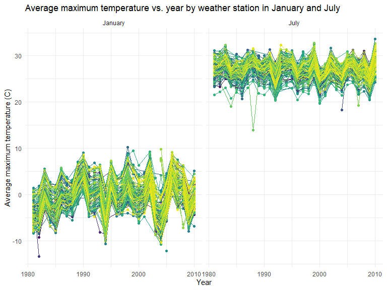

Homework 3
================
Ashwini Varghese
2022-10-17

## Setup for coding

## Problem 1

Let’s load the dataset:

``` r
data("instacart")

instacart
```

    ## # A tibble: 1,384,617 × 15
    ##    order_id product_id add_to_…¹ reord…² user_id eval_…³ order…⁴ order…⁵ order…⁶
    ##       <int>      <int>     <int>   <int>   <int> <chr>     <int>   <int>   <int>
    ##  1        1      49302         1       1  112108 train         4       4      10
    ##  2        1      11109         2       1  112108 train         4       4      10
    ##  3        1      10246         3       0  112108 train         4       4      10
    ##  4        1      49683         4       0  112108 train         4       4      10
    ##  5        1      43633         5       1  112108 train         4       4      10
    ##  6        1      13176         6       0  112108 train         4       4      10
    ##  7        1      47209         7       0  112108 train         4       4      10
    ##  8        1      22035         8       1  112108 train         4       4      10
    ##  9       36      39612         1       0   79431 train        23       6      18
    ## 10       36      19660         2       1   79431 train        23       6      18
    ## # … with 1,384,607 more rows, 6 more variables: days_since_prior_order <int>,
    ## #   product_name <chr>, aisle_id <int>, department_id <int>, aisle <chr>,
    ## #   department <chr>, and abbreviated variable names ¹​add_to_cart_order,
    ## #   ²​reordered, ³​eval_set, ⁴​order_number, ⁵​order_dow, ⁶​order_hour_of_day

The dataset has 15 variables and 1,384,617 observations. Key variables
include identifiers for user, order, and product; the order in which
each product was added to the cart. There are several order-level
variables, describing the day and time of the order, and number of days
since prior order. Then there are several item-specific variables,
describing the product name (e.g. Yogurt, Avocado), department
(e.g. dairy and eggs, produce), and aisle (e.g. yogurt, fresh fruits),
and whether the item has been ordered by this user in the past.

To find how many aisles there are as well as which aisles have the most
items ordered from we can use the below code:

``` r
instacart %>% 
  summarize(n_distinct(aisle))
```

    ## # A tibble: 1 × 1
    ##   `n_distinct(aisle)`
    ##                 <int>
    ## 1                 134

``` r
instacart %>% 
  count(aisle) %>% 
  arrange(desc(n))
```

    ## # A tibble: 134 × 2
    ##    aisle                              n
    ##    <chr>                          <int>
    ##  1 fresh vegetables              150609
    ##  2 fresh fruits                  150473
    ##  3 packaged vegetables fruits     78493
    ##  4 yogurt                         55240
    ##  5 packaged cheese                41699
    ##  6 water seltzer sparkling water  36617
    ##  7 milk                           32644
    ##  8 chips pretzels                 31269
    ##  9 soy lactosefree                26240
    ## 10 bread                          23635
    ## # … with 124 more rows

There are 134 aisles and the aisles where the most food came from are
fresh vegetables, fresh fruits, and packaged vegetables and fruits.

Now we will display these amounts in a plot and show the number of items
ordered in each aisle.

``` r
instacart %>% 
  count(aisle) %>% 
  filter(n > 10000) %>% 
  mutate(aisle = fct_reorder(aisle, n)) %>% 
  ggplot(aes(x = aisle, y = n)) + 
  geom_point() + 
  labs(title = "Number of items ordered in each aisle") +
  theme(axis.text.x = element_text(angle = 60, hjust = 1))
```


Here is a table showing the three most popular items in the following
three aisles: baking ingredients, dog food care, packaged vegetables
fruits

``` r
instacart %>% 
  filter(aisle %in% c("baking ingredients", "dog food care", "packaged vegetables fruits")) %>%
  group_by(aisle) %>% 
  count(product_name) %>% 
  mutate(rank = min_rank(desc(n))) %>% 
  filter(rank < 4) %>% 
  arrange(desc(n)) %>%
  knitr::kable()
```

| aisle                      | product_name                                  |    n | rank |
|:---------------------------|:----------------------------------------------|-----:|-----:|
| packaged vegetables fruits | Organic Baby Spinach                          | 9784 |    1 |
| packaged vegetables fruits | Organic Raspberries                           | 5546 |    2 |
| packaged vegetables fruits | Organic Blueberries                           | 4966 |    3 |
| baking ingredients         | Light Brown Sugar                             |  499 |    1 |
| baking ingredients         | Pure Baking Soda                              |  387 |    2 |
| baking ingredients         | Cane Sugar                                    |  336 |    3 |
| dog food care              | Snack Sticks Chicken & Rice Recipe Dog Treats |   30 |    1 |
| dog food care              | Organix Chicken & Brown Rice Recipe           |   28 |    2 |
| dog food care              | Small Dog Biscuits                            |   26 |    3 |

This last table shows the average hour of the day in which Pink Lady
Apples and Coffee Ice Cream are ordered on each day of the week.

``` r
instacart %>%
  filter(product_name %in% c("Pink Lady Apples", "Coffee Ice Cream")) %>%
  group_by(product_name, order_dow) %>%
  summarize(mean_hour = mean(order_hour_of_day)) %>%
  spread(key = order_dow, value = mean_hour) %>%
  knitr::kable(digits = 2)
```

    ## `summarise()` has grouped output by 'product_name'. You can override using the
    ## `.groups` argument.

| product_name     |     0 |     1 |     2 |     3 |     4 |     5 |     6 |
|:-----------------|------:|------:|------:|------:|------:|------:|------:|
| Coffee Ice Cream | 13.77 | 14.32 | 15.38 | 15.32 | 15.22 | 12.26 | 13.83 |
| Pink Lady Apples | 13.44 | 11.36 | 11.70 | 14.25 | 11.55 | 12.78 | 11.94 |

## Problem 2

Let’s load, tidy, and wrangling this dataset:

``` r
accel = read_csv("./accel_data.csv") %>% 
    janitor::clean_names() %>% 
    pivot_longer(
      activity_1:activity_1440,
      names_to = "minute",
      names_prefix = "activity_",
      values_to = "activity_count"
    ) %>% 
    mutate(day_type = if_else(day == "Saturday", "weekend",
                              if_else(day == "Sunday", "weekend", "weekday"))) %>%
    mutate(day = as.factor(day)) %>% 
    mutate(minute = as.numeric(minute)) %>% 
    mutate(day_type = as.factor(day_type)) %>% 
    mutate(day = fct_relevel(day, "Sunday", "Monday", "Tuesday", "Wednesday", "Thursday", "Friday", "Saturday"))
```

    ## Rows: 35 Columns: 1443
    ## ── Column specification ────────────────────────────────────────────────────────
    ## Delimiter: ","
    ## chr    (1): day
    ## dbl (1442): week, day_id, activity.1, activity.2, activity.3, activity.4, ac...
    ## 
    ## ℹ Use `spec()` to retrieve the full column specification for this data.
    ## ℹ Specify the column types or set `show_col_types = FALSE` to quiet this message.

``` r
accel
```

    ## # A tibble: 50,400 × 6
    ##     week day_id day    minute activity_count day_type
    ##    <dbl>  <dbl> <fct>   <dbl>          <dbl> <fct>   
    ##  1     1      1 Friday      1           88.4 weekday 
    ##  2     1      1 Friday      2           82.2 weekday 
    ##  3     1      1 Friday      3           64.4 weekday 
    ##  4     1      1 Friday      4           70.0 weekday 
    ##  5     1      1 Friday      5           75.0 weekday 
    ##  6     1      1 Friday      6           66.3 weekday 
    ##  7     1      1 Friday      7           53.8 weekday 
    ##  8     1      1 Friday      8           47.8 weekday 
    ##  9     1      1 Friday      9           55.5 weekday 
    ## 10     1      1 Friday     10           43.0 weekday 
    ## # … with 50,390 more rows

Description of dataset:

This dataset has 6 variable (`ncol(accel)`); `week`, `day`, and `day_id`
were from the original file untouched besides cleaning up the names
using `janitor::clean_names()` but the other 3 (`minute,`
`activity_count`, and `day_type`) are new variables created using
`pivot_longer` and `mutate`. This dataset has 50,400 observations, found
using `nrow(accel)`.

Let’s now make a new variable that is the total activity count for a
given day and show it in a table:

``` r
accel2 <- accel %>% 
  group_by(week, day) %>% 
  summarize(total_activity = sum(activity_count)) %>% 
  pivot_wider(
    names_from = day,
    values_from = total_activity) %>% 
  knitr::kable(digits = 1)
```

    ## `summarise()` has grouped output by 'week'. You can override using the
    ## `.groups` argument.

``` r
accel2
```

| week | Sunday |   Monday |  Tuesday | Wednesday | Thursday |   Friday | Saturday |
|-----:|-------:|---------:|---------:|----------:|---------:|---------:|---------:|
|    1 | 631105 |  78828.1 | 307094.2 |    340115 | 355923.6 | 480542.6 |   376254 |
|    2 | 422018 | 295431.0 | 423245.0 |    440962 | 474048.0 | 568839.0 |   607175 |
|    3 | 467052 | 685910.0 | 381507.0 |    468869 | 371230.0 | 467420.0 |   382928 |
|    4 | 260617 | 409450.0 | 319568.0 |    434460 | 340291.0 | 154049.0 |     1440 |
|    5 | 138421 | 389080.0 | 367824.0 |    445366 | 549658.0 | 620860.0 |     1440 |

From this table, it is hard to determine if any trends are apparent over
the days and by each week.

So let’s then make a single panel that shows the 24-hour activity time
courses for each day:

``` r
accel %>%
  ggplot(aes(x = minute, y = activity_count, color = day)) +
  geom_point(aes(alpha = .5)) +
   labs(
    title = "Activity counts by minute for each day",
    x = "Minute of the day",
    y = "Activity count"
  )
```


From this graph, we can see that the activity counts throughout any
given day are usually not higher than about 1,875. The exceptions are at
about the 400th minute, 560th minute, 650th minute, 1000th minute and
1,250th minute. The days of the week that we see these higher activity
counts are on Thursdays, Fridays, Sundays, and Saturdays, respectively.
At the 1,250th minute, on various days throughout the week, there is a
large activity count.

## Problem 3

Let’s load the data:

``` r
data("ny_noaa")

ny_noaa
```

    ## # A tibble: 2,595,176 × 7
    ##    id          date        prcp  snow  snwd tmax  tmin 
    ##    <chr>       <date>     <int> <int> <int> <chr> <chr>
    ##  1 US1NYAB0001 2007-11-01    NA    NA    NA <NA>  <NA> 
    ##  2 US1NYAB0001 2007-11-02    NA    NA    NA <NA>  <NA> 
    ##  3 US1NYAB0001 2007-11-03    NA    NA    NA <NA>  <NA> 
    ##  4 US1NYAB0001 2007-11-04    NA    NA    NA <NA>  <NA> 
    ##  5 US1NYAB0001 2007-11-05    NA    NA    NA <NA>  <NA> 
    ##  6 US1NYAB0001 2007-11-06    NA    NA    NA <NA>  <NA> 
    ##  7 US1NYAB0001 2007-11-07    NA    NA    NA <NA>  <NA> 
    ##  8 US1NYAB0001 2007-11-08    NA    NA    NA <NA>  <NA> 
    ##  9 US1NYAB0001 2007-11-09    NA    NA    NA <NA>  <NA> 
    ## 10 US1NYAB0001 2007-11-10    NA    NA    NA <NA>  <NA> 
    ## # … with 2,595,166 more rows

The dataset has 7 variables (`ncol(ny_noaa)`) and 2,595,176 observations
(`nrow(ny_noaa)`). It has a combination of integer and character
variables, with also a date variable. The variables that make up the
dataset are an ID variable of the weather station, date of observation,
precipitation (mm), snowfall (mm), snow depth (mm), and the maximum and
minimum temperatures in Celsius. There is a large number of missing data
because each weather station may collect only a subset of these
variables, so the dataset has observations with missing data.

Let’s now do some data cleaning of this dataset:

``` r
ny_noaa_clean <- ny_noaa %>% 
  janitor::clean_names() %>%
  separate(date, sep = "-", into = c("year", "month", "day")) %>%
  mutate_at(c(2:9), as.numeric) %>% 
  mutate(prcp = prcp/10) %>% 
  mutate(tmin = tmin/10, tmax = tmax/10) %>% 
  mutate(month = month.name[as.numeric(month)])
ny_noaa_clean
```

    ## # A tibble: 2,595,176 × 9
    ##    id           year month      day  prcp  snow  snwd  tmax  tmin
    ##    <chr>       <dbl> <chr>    <dbl> <dbl> <dbl> <dbl> <dbl> <dbl>
    ##  1 US1NYAB0001  2007 November     1    NA    NA    NA    NA    NA
    ##  2 US1NYAB0001  2007 November     2    NA    NA    NA    NA    NA
    ##  3 US1NYAB0001  2007 November     3    NA    NA    NA    NA    NA
    ##  4 US1NYAB0001  2007 November     4    NA    NA    NA    NA    NA
    ##  5 US1NYAB0001  2007 November     5    NA    NA    NA    NA    NA
    ##  6 US1NYAB0001  2007 November     6    NA    NA    NA    NA    NA
    ##  7 US1NYAB0001  2007 November     7    NA    NA    NA    NA    NA
    ##  8 US1NYAB0001  2007 November     8    NA    NA    NA    NA    NA
    ##  9 US1NYAB0001  2007 November     9    NA    NA    NA    NA    NA
    ## 10 US1NYAB0001  2007 November    10    NA    NA    NA    NA    NA
    ## # … with 2,595,166 more rows

We cleaned up the data by cleaning the names, separating the variable
for date of observation into the year, month, and day, converting all
the variables except the ID into a numeric variable, and converting the
`prcp`, `tmix`, and `tmax` variables from it’s tenths value to it’s
whole value by dividing by 10.

We will next find the most commonly observed value for `snowfall` using
the `count` and `order` functions.

``` r
snowfall <- ny_noaa_clean %>% 
  count(snow, name = "n_obs")
  
snowfall <- snowfall[order(-snowfall$n_obs),] %>% 
  knitr::kable(digits = 1)

snowfall
```

|  snow |   n_obs |
|------:|--------:|
|     0 | 2008508 |
|    NA |  381221 |
|    25 |   31022 |
|    13 |   23095 |
|    51 |   18274 |
|    76 |   10173 |
|     8 |    9962 |
|     5 |    9748 |
|    38 |    9197 |
|     3 |    8790 |
|   102 |    6552 |
|    10 |    5106 |
|    20 |    4797 |
|    64 |    4506 |
|   127 |    3901 |
|    15 |    3672 |
|    18 |    3226 |
|   152 |    3131 |
|    30 |    2814 |
|    89 |    2535 |
|    33 |    2380 |
|    46 |    2123 |
|    28 |    2118 |
|    23 |    1959 |
|   178 |    1650 |
|    36 |    1630 |
|   114 |    1578 |
|   203 |    1475 |
|    41 |    1467 |
|    43 |    1337 |
|    58 |    1198 |
|    56 |    1179 |
|    53 |    1155 |
|    71 |    1075 |
|   140 |     994 |
|    48 |     918 |
|    61 |     849 |
|    81 |     811 |
|    66 |     790 |
|   254 |     786 |
|   229 |     744 |
|    69 |     726 |
|    97 |     704 |
|    79 |     635 |
|   165 |     614 |
|    84 |     553 |
|   107 |     504 |
|    86 |     476 |
|    74 |     463 |
|   305 |     451 |
|    91 |     428 |
|   191 |     426 |
|   122 |     411 |
|    94 |     404 |
|   109 |     393 |
|   279 |     369 |
|   104 |     349 |
|   132 |     310 |
|   216 |     292 |
|    99 |     276 |
|   117 |     276 |
|   147 |     268 |
|   135 |     253 |
|   119 |     248 |
|   112 |     243 |
|   356 |     235 |
|   330 |     226 |
|   130 |     217 |
|   157 |     209 |
|   241 |     192 |
|   142 |     187 |
|   173 |     187 |
|   155 |     186 |
|   124 |     183 |
|   137 |     173 |
|   145 |     172 |
|   160 |     149 |
|   381 |     139 |
|   163 |     133 |
|   183 |     132 |
|   198 |     130 |
|   267 |     130 |
|   150 |     124 |
|   185 |     117 |
|   406 |     116 |
|   168 |     115 |
|   170 |     104 |
|   457 |     100 |
|   208 |      98 |
|   180 |      93 |
|   292 |      81 |
|   175 |      80 |
|   188 |      77 |
|   196 |      75 |
|   206 |      74 |
|   193 |      70 |
|   318 |      70 |
|   211 |      69 |
|   343 |      63 |
|   432 |      63 |
|   224 |      61 |
|   201 |      60 |
|   213 |      58 |
|   249 |      58 |
|   218 |      55 |
|   508 |      54 |
|   221 |      53 |
|   234 |      52 |
|   236 |      49 |
|   259 |      48 |
|   274 |      45 |
|   483 |      44 |
|   231 |      43 |
|   239 |      39 |
|   246 |      37 |
|   284 |      37 |
|   244 |      36 |
|   226 |      35 |
|   559 |      35 |
|   610 |      35 |
|   257 |      34 |
|   368 |      32 |
|   310 |      29 |
|   262 |      28 |
|   282 |      28 |
|   394 |      27 |
|   264 |      24 |
|   290 |      24 |
|   300 |      24 |
|   272 |      22 |
|   287 |      22 |
|   302 |      22 |
|   312 |      22 |
|   323 |      22 |
|   251 |      21 |
|   277 |      20 |
|   295 |      20 |
|   470 |      20 |
|   584 |      20 |
|   269 |      19 |
|   307 |      17 |
|   338 |      17 |
|   345 |      17 |
|   762 |      17 |
|   533 |      16 |
|   351 |      15 |
|   361 |      15 |
|   366 |      15 |
|   419 |      15 |
|   297 |      14 |
|   363 |      14 |
|   315 |      13 |
|   335 |      13 |
|   340 |      13 |
|   660 |      13 |
|   325 |      12 |
|   353 |      12 |
|   358 |      12 |
|   376 |      12 |
|   414 |      12 |
|   401 |      10 |
|   635 |      10 |
|   711 |      10 |
|   333 |       9 |
|   417 |       9 |
|   737 |       9 |
|   386 |       8 |
|   411 |       8 |
|   427 |       8 |
|   437 |       8 |
|   445 |       8 |
|   521 |       8 |
|   320 |       7 |
|   404 |       7 |
|   434 |       7 |
|   328 |       6 |
|   348 |       6 |
|   373 |       6 |
|   384 |       6 |
|   409 |       6 |
|   467 |       6 |
|   546 |       6 |
|   686 |       6 |
|   378 |       5 |
|   389 |       5 |
|   396 |       5 |
|   422 |       5 |
|   447 |       5 |
|   450 |       5 |
|   452 |       5 |
|   460 |       5 |
|   465 |       5 |
|   475 |       5 |
|   371 |       4 |
|   399 |       4 |
|   455 |       4 |
|   472 |       4 |
|   478 |       4 |
|   488 |       4 |
|   549 |       4 |
|   554 |       4 |
|   597 |       4 |
|   699 |       4 |
|   787 |       4 |
|   914 |       4 |
|   424 |       3 |
|   439 |       3 |
|   462 |       3 |
|   495 |       3 |
|   513 |       3 |
|   518 |       3 |
|   572 |       3 |
|   594 |       3 |
|   632 |       3 |
|   775 |       3 |
|   480 |       2 |
|   490 |       2 |
|   498 |       2 |
|   503 |       2 |
|   505 |       2 |
|   511 |       2 |
|   516 |       2 |
|   523 |       2 |
|   526 |       2 |
|   528 |       2 |
|   551 |       2 |
|   561 |       2 |
|   564 |       2 |
|   592 |       2 |
|   622 |       2 |
|   630 |       2 |
|   643 |       2 |
|   663 |       2 |
|   721 |       2 |
|   813 |       2 |
|   838 |       2 |
|   864 |       2 |
|   -13 |       1 |
|   391 |       1 |
|   429 |       1 |
|   536 |       1 |
|   544 |       1 |
|   556 |       1 |
|   566 |       1 |
|   569 |       1 |
|   574 |       1 |
|   577 |       1 |
|   579 |       1 |
|   587 |       1 |
|   589 |       1 |
|   607 |       1 |
|   612 |       1 |
|   615 |       1 |
|   620 |       1 |
|   625 |       1 |
|   645 |       1 |
|   648 |       1 |
|   650 |       1 |
|   665 |       1 |
|   693 |       1 |
|   704 |       1 |
|   734 |       1 |
|   754 |       1 |
|   808 |       1 |
|   810 |       1 |
|   843 |       1 |
|   861 |       1 |
|   871 |       1 |
|   892 |       1 |
|   940 |       1 |
|   953 |       1 |
|   965 |       1 |
|   978 |       1 |
|  1041 |       1 |
|  1067 |       1 |
|  1105 |       1 |
|  1143 |       1 |
|  1207 |       1 |
|  6350 |       1 |
|  7122 |       1 |
|  7765 |       1 |
| 10160 |       1 |

We can see from the resulting table that the most observed value for
`snowfall` is 0 mm. After that, we have 25 mm and the third highest
value is 13 mm. These are the highest values maybe because the
observations in this dataset were collected from weather stations in New
York state and for a majority of the year, the weather is not optimal
for snow.

Now let’s make a two-panel plot showing the average max temperature in
January and in July in each station across years.

``` r
avgtmax <- ny_noaa_clean %>% 
  filter(
    month %in% c("January", "July")
  ) %>% 
  drop_na(tmax) %>% 
  group_by(year, id, month) %>% 
  summarize(
    avg_tmax = mean(tmax, na.rm = TRUE)
  ) 
```

    ## `summarise()` has grouped output by 'year', 'id'. You can override using the
    ## `.groups` argument.

``` r
ggplot(avgtmax, (aes(x = year, y = avg_tmax, color = id))) +
  geom_point() +
  geom_line() +
  labs(
    title = "Average maximum temperature vs. year by weather station in January and July",
    x = "Year",
    y = "Average maximum temperature (C)"
  ) +
  facet_grid(. ~ month) +
  theme(legend.position = "none")
```



The overall trends in these graphs are that in January, the average
maximum temperature from 1980 to 2010 was between -10 and 10 degrees
Celsius. We have a few outliers at about 11, -9, -13, and -12. In July,
the average maximum temperature from 1980 to 2010 was between 20 and 35
degrees Celsius. Some of the outliers were 14, 18, 19, and 36.

Now let’s make a two-panel plot showing (i) tmax vs tmin for the full
dataset and (ii) the distribution of snowfall values greater than 0 and
less than 100 separately by year

``` r
temp_plot = 
ny_noaa_clean %>% 
ggplot(aes(x = tmin, y = tmax)) +
  geom_hex() +
    labs(
    title = "Minimum and maximum temperatures",
    x = "Minimum temperature (C)",
    y = "Maximum temperature (C)"
    )


snow <- ny_noaa_clean %>% 
  filter(snow > 0 & snow < 100) %>%
  mutate(snow = as.numeric(snow)) %>%
  mutate(year = as.factor(year))

snow_plot =   
ggplot(snow, aes(x = snow, y = year)) +
  geom_density_ridges() +
  labs(
    title = "Snowfall values by year",
    x = "Snowfall (mm)",
    y = "Year"
    )

temp_plot + snow_plot
```

    ## Picking joint bandwidth of 3.76


In these plots, we see that there is large number of days in which the
maximum temperature and minimum temperatures were between 15 for tmin
and 30 for tmax and -15 for tmin and -5 for tmax. For the snowfall plot,
from 1981 to 2010, most of the days with snowfall have a value between 0
and 30 mm. There is also another large set of days that had snowfall
values between 40 and 60 mm and another between 70 and 80 mm.
